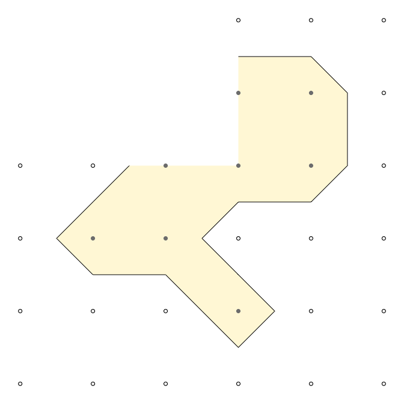
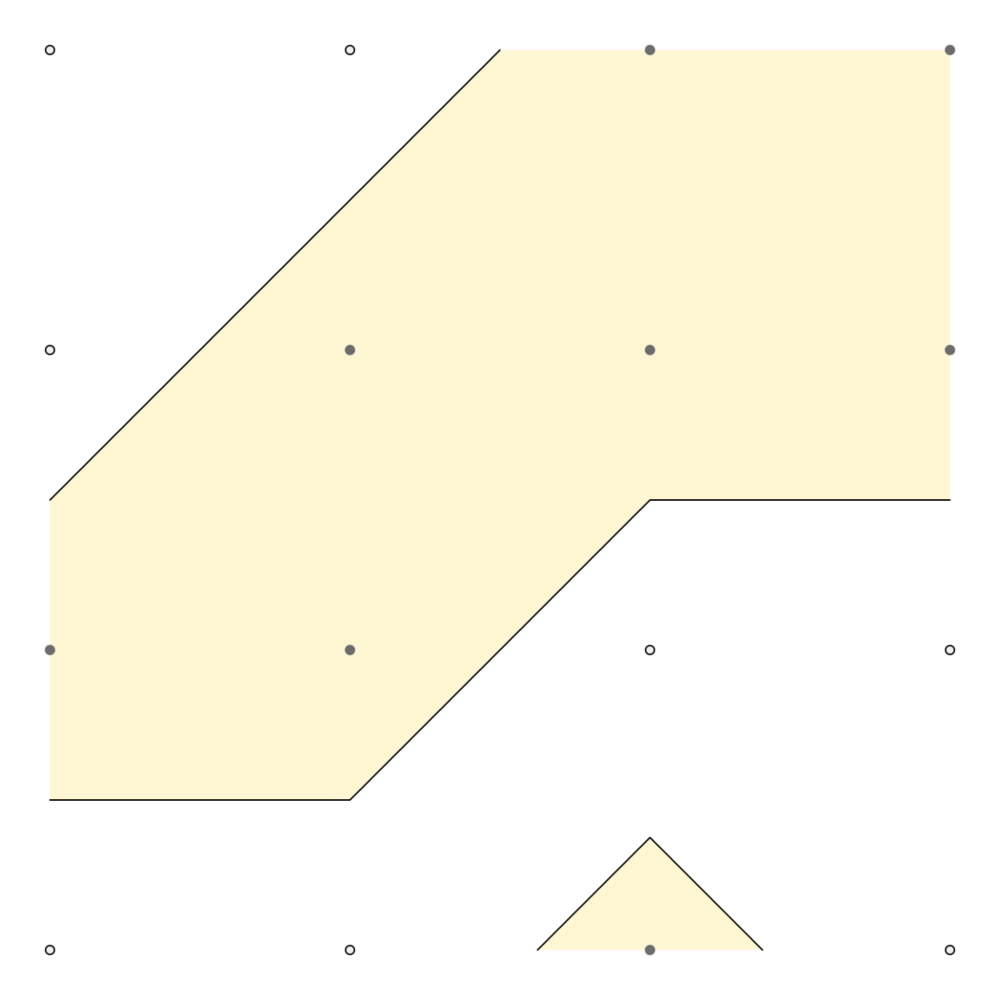

<!-- README.md is generated from README.Rmd. Please edit that file -->

# isoband

[](https://travis-ci.org/clauswilke/isoband)
[](https://codecov.io/github/clauswilke/isoband?branch=master)

Generate contour lines (isolines) and contour polygons (isobands) from
regularly spaced grids containing elevation data.

## Installation

Install from github with:

``` r
devtools::install_github("clauswilke/isoband")
```

## Examples

The two main workhorses of the package are the functions `isolines()`
and `isobands()`, respectively. They return a list of isolines/isobands
for each isolevel specified. Each isoline/isoband consists of vectors of
x and y coordinates, as well as a vector of ids specifying which sets of
coordinates should be connected. This format can be handed directly to
`grid.polyline()`/`grid.path()` for drawing. However, we can also
convert the output to spatial features and draw with ggplot2 (see
below).

``` r
library(isoband)

m <- matrix(c(0, 0, 0, 0, 0,
              0, 1, 2, 1, 0,
              0, 1, 2, 0, 0,
              0, 1, 0, 1, 0,
              0, 0, 0, 0, 0), 5, 5, byrow = TRUE)

isolines(1:ncol(m), 1:nrow(m), m, 0.5)
#> $`0.5`
#> $`0.5`$x
#>  [1] 4.00 3.50 3.00 2.50 2.00 1.50 1.50 1.50 2.00 3.00 4.00 4.50 4.00 3.75
#> [15] 4.00 4.50 4.00
#> 
#> $`0.5`$y
#>  [1] 4.50 4.00 3.75 4.00 4.50 4.00 3.00 2.00 1.50 1.25 1.50 2.00 2.50 3.00
#> [15] 3.50 4.00 4.50
#> 
#> $`0.5`$id
#>  [1] 1 1 1 1 1 1 1 1 1 1 1 1 1 1 1 1 1
#> 
#> 
#> attr(,"class")
#> [1] "isolines" "iso"

isobands(1:ncol(m), 1:nrow(m), m, 0.5, 1.5)
#> $`0.5:1.5`
#> $`0.5:1.5`$x
#>  [1] 2.50 2.00 1.50 1.50 1.50 2.00 3.00 4.00 4.50 4.00 3.75 4.00 4.50 4.00
#> [15] 3.50 3.00 3.00 3.25 3.50 3.00 2.50 2.50
#> 
#> $`0.5:1.5`$y
#>  [1] 4.00 4.50 4.00 3.00 2.00 1.50 1.25 1.50 2.00 2.50 3.00 3.50 4.00 4.50
#> [15] 4.00 3.75 3.25 3.00 2.00 1.75 2.00 3.00
#> 
#> $`0.5:1.5`$id
#>  [1] 1 1 1 1 1 1 1 1 1 1 1 1 1 1 1 1 2 2 2 2 2 2
#> 
#> 
#> attr(,"class")
#> [1] "isobands" "iso"
```

The function `plot_iso()` is a convenience function for debugging and
testing.

``` r
plot_iso(m, 0.5, 1.5)
```


A few more simple examples. Missing values and disconnected areas are
all handled correctly.

``` r
m <- matrix(c(0, 0, 0, 0, 0, 0,
              0, 0, 0, 1, 1, 0,
              0, 0, 1, 1, 1, 0,
              0, 1, 1, 0, 0, 0,
              0, 0, 0, 1, 0, 0,
              0, 0, 0, 0, 0, 0), 6, 6, byrow = TRUE)
plot_iso(m, 0.5, 1.5)
```


``` r

m <- matrix(c(NA, NA, NA, 0, 0, 0,
              NA, NA, NA, 1, 1, 0,
               0,  0,  1, 1, 1, 0,
               0,  1,  1, 0, 0, 0,
               0,  0,  0, 1, 0, 0,
               0,  0,  0, 0, 0, 0), 6, 6, byrow = TRUE)
plot_iso(m, 0.5, 1.5)
```



``` r

m <- matrix(c(0, 0, 1, 1,
              0, 1, 1, 1,
              1, 1, 0, 0,
              0, 0, 0.8, 0), 4, 4, byrow = TRUE)
plot_iso(m, 0.5, 1.5)
```



The algorithm has no problem with larger datasets. Let’s calculate
isolines and isobands for the volcano dataset, convert to sf, and plot
with ggplot2.

``` r
library(ggplot2)
library(sf)
#> Linking to GEOS 3.6.1, GDAL 2.1.3, PROJ 4.9.3

m <- volcano
b <- isobands((1:ncol(m))/(ncol(m)+1), (nrow(m):1)/(nrow(m)+1), m, 10*(9:19), 10*(10:20))
l <- isolines((1:ncol(m))/(ncol(m)+1), (nrow(m):1)/(nrow(m)+1), m, 10*(10:19))

bands <- iso_to_sfg(b)
data_bands <- st_sf(
  level = 1:length(bands),
  geometry = st_sfc(bands)
)
lines <- iso_to_sfg(l)
data_lines <- st_sf(
  level = 2:(length(lines)+1),
  geometry = st_sfc(lines)
)

ggplot() +
  geom_sf(data = data_bands, aes(fill = level), color = NA, alpha = 0.7) +
  geom_sf(data = data_lines, color = "black") +
  scale_fill_viridis_c(guide = "none") +
  coord_sf(expand = FALSE)
```


Isolining is about as fast as `grDevices::contourLines()`, isobanding is
approximately 2.5 times slower.

``` r
microbenchmark::microbenchmark(
  grDevices::contourLines(1:ncol(volcano), 1:nrow(volcano), volcano, levels = 10*(10:18)),
  isolines(1:ncol(volcano), 1:nrow(volcano), volcano, 10*(10:18)),
  isobands(1:ncol(volcano), 1:nrow(volcano), volcano, 10*(9:17), 10*(10:18))
)
#> Unit: milliseconds
#>                                                                                            expr
#>  grDevices::contourLines(1:ncol(volcano), 1:nrow(volcano), volcano,      levels = 10 * (10:18))
#>                               isolines(1:ncol(volcano), 1:nrow(volcano), volcano, 10 * (10:18))
#>             isobands(1:ncol(volcano), 1:nrow(volcano), volcano, 10 * (9:17),      10 * (10:18))
#>       min       lq     mean   median       uq      max neval
#>  1.650314 1.853480 2.711182 2.147723 3.094145 12.04088   100
#>  1.746031 1.915165 2.367075 2.196047 2.662343  4.88075   100
#>  4.336652 4.812021 5.778308 5.348152 6.333666 13.80761   100
```
