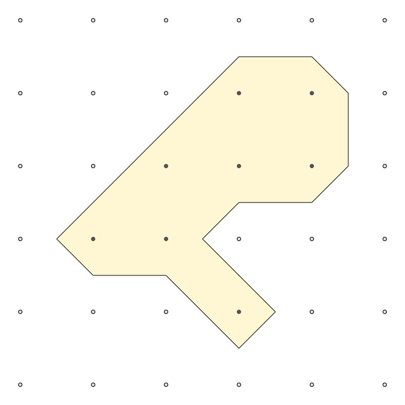
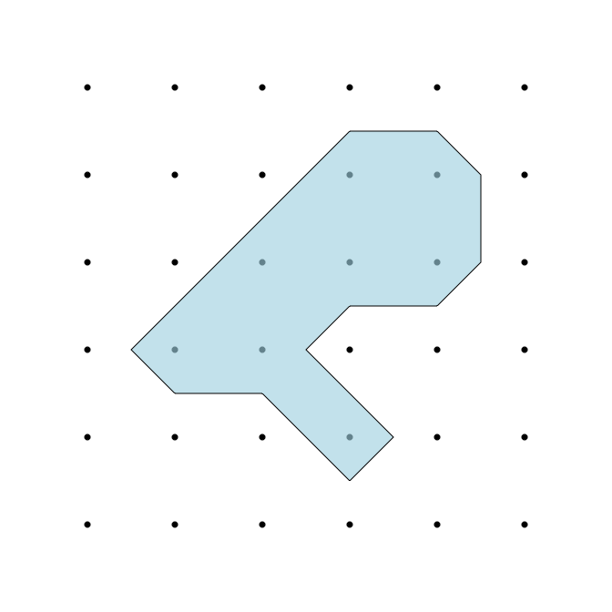

<!-- README.md is generated from README.Rmd. Please edit that file -->

# isoband

Generate contour lines (isolines) and contour polygons (isobands) from
regularly spaced grids containing elevation data.

## Installation

Install from github with:

``` r
devtools::install_github("clauswilke/isoband")
```

## Example

Simple isobanding examples:

``` r
library(isoband)
library(grid)

plot_iso <- function(m, vlo, vhi) {
  df1 <- isobands((1:ncol(m))/(ncol(m)+1), (nrow(m):1)/(nrow(m)+1), m, vlo, vhi)[[1]]
  df2 <- isolines((1:ncol(m))/(ncol(m)+1), (nrow(m):1)/(nrow(m)+1), m, vlo)[[1]]
  g <- expand.grid(x = (1:ncol(m))/(ncol(m)+1), y = (nrow(m):1)/(nrow(m)+1))
  grid.newpage()
  grid.points(g$x, g$y, default.units = "npc", pch = 19, size = unit(0.5, "char"))
  grid.path(df1$x, df1$y, df1$id, gp = gpar(fill = "#acd8e6a0", col = NA))
  grid.polyline(df2$x, df2$y, df2$id)
}

m <- matrix(c(0, 1, 0,
              0, 1, 0,
              0, 0, 0), 3, 3, byrow = TRUE)
plot_iso(m, 0.5, 1.5)
```



``` r

m <- matrix(c(0, 0, 0, 0, 0, 0,
              0, 0, 0, 1, 1, 0,
              0, 0, 1, 1, 1, 0,
              0, 1, 1, 0, 0, 0,
              0, 0, 0, 1, 0, 0,
              0, 0, 0, 0, 0, 0), 6, 6, byrow = TRUE)
plot_iso(m, 0.5, 1.5)
```



``` r

m <- matrix(c(0, 0, 1, 1, 0, 1, 1, 1, 1, 1, 0, 0, 0, 0, 0.8, 0), 4, 4, byrow = TRUE)
plot_iso(m, 0.5, 1.5)
```


Isobanding the volcano dataset:

``` r
m <- volcano
b <- isobands((1:ncol(m))/(ncol(m)+1), (nrow(m):1)/(nrow(m)+1), m, c(80, 120, 150), c(110, 140, 152))
l <- isolines((1:ncol(m))/(ncol(m)+1), (nrow(m):1)/(nrow(m)+1), m, c(110, 120, 140, 150, 152))

grid.newpage()
grid.path(b[[1]]$x, b[[1]]$y, b[[1]]$id, gp = gpar(fill = "cornsilk", col = NA))
grid.path(b[[2]]$x, b[[2]]$y, b[[2]]$id, gp = gpar(fill = "lightblue", col = NA))
grid.path(b[[3]]$x, b[[3]]$y, b[[3]]$id, gp = gpar(fill = "tomato", col = NA))
for (i in seq_along(l)) {
  grid.polyline(l[[i]]$x, l[[i]]$y, l[[i]]$id)
}
```


Isolining is ~20% faster than `grDevices::contourLines()`, isobanding is
about 2.5 times slower.

``` r
microbenchmark::microbenchmark(
  grDevices::contourLines(1:ncol(volcano), 1:nrow(volcano), volcano, levels = 10*(10:18)),
  isolines(1:ncol(volcano), 1:nrow(volcano), volcano, 10*(10:18)),
  isobands(1:ncol(volcano), 1:nrow(volcano), volcano, 10*(9:17), 10*(10:18))
)
#> Unit: milliseconds
#>                                                                                            expr
#>  grDevices::contourLines(1:ncol(volcano), 1:nrow(volcano), volcano,      levels = 10 * (10:18))
#>                               isolines(1:ncol(volcano), 1:nrow(volcano), volcano, 10 * (10:18))
#>             isobands(1:ncol(volcano), 1:nrow(volcano), volcano, 10 * (9:17),      10 * (10:18))
#>       min       lq     mean   median       uq       max neval
#>  1.663728 1.793058 2.532347 2.021203 2.640874  9.775751   100
#>  1.314199 1.384212 1.709409 1.557561 1.734687 10.332590   100
#>  4.091069 4.278503 4.817590 4.502429 4.931143 12.724068   100
```
