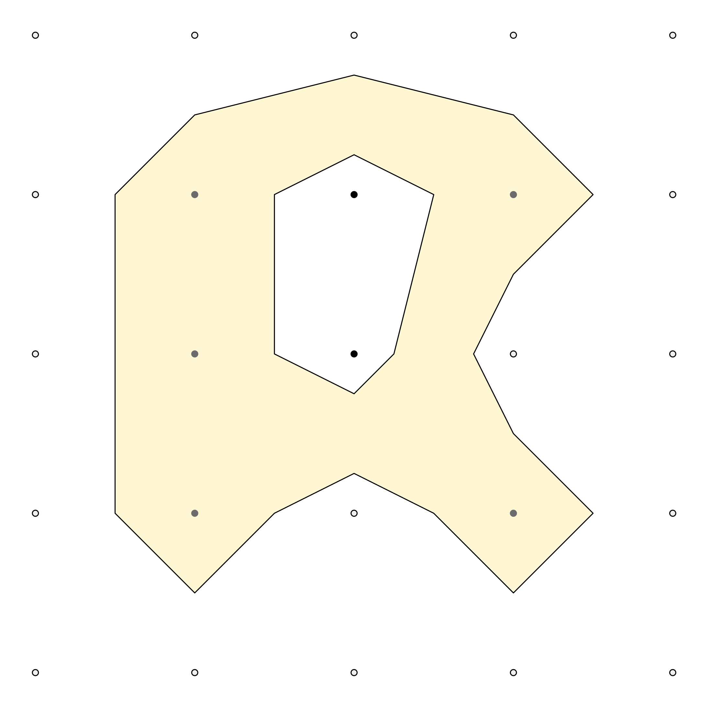
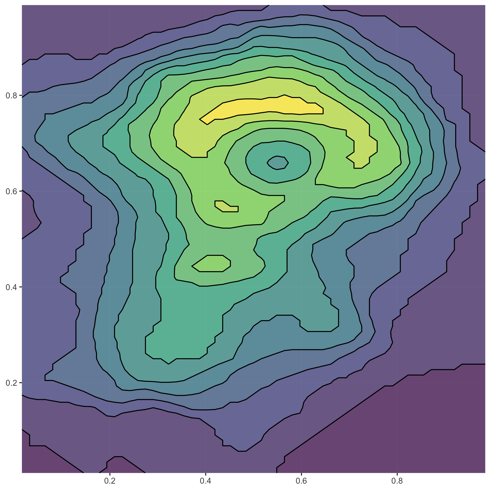

<!-- README.md is generated from README.Rmd. Please edit that file -->

# isoband 

<!-- badges: start -->

[](https://github.com/wilkelab/isoband/actions)
[](https://codecov.io/github/wilkelab/isoband?branch=master)
[](https://cran.r-project.org/package=isoband)
[](https://lifecycle.r-lib.org/articles/stages.html)
<!-- badges: end -->

Generate contour lines (isolines) and contour polygons (isobands) from
regularly spaced grids containing elevation data.

## Installation

Install the latest official release from CRAN via:

``` r
install.packages("isoband")
```

Install the current development from github via:

``` r
remotes::install_github("wilkelab/isoband")
```

## Examples

The two main workhorses of the package are the functions `isolines()`
and `isobands()`, respectively. They return a list of isolines/isobands
for each isolevel specified. Each isoline/isoband consists of vectors of
x and y coordinates, as well as a vector of ids specifying which sets of
coordinates should be connected. This format can be handed directly to
`grid.polyline()`/`grid.path()` for drawing. However, we can also
convert the output to spatial features and draw with ggplot2 (see
below).

``` r
library(isoband)

m <- matrix(c(0, 0, 0, 0, 0,
              0, 1, 2, 1, 0,
              0, 1, 2, 0, 0,
              0, 1, 0, 1, 0,
              0, 0, 0, 0, 0), 5, 5, byrow = TRUE)

isolines(1:ncol(m), 1:nrow(m), m, 0.5)
#> $`0.5`
#> $`0.5`$x
#>  [1] 4.00 3.50 3.00 2.50 2.00 1.50 1.50 1.50 2.00 3.00 4.00 4.50 4.00 3.75 4.00
#> [16] 4.50 4.00
#> 
#> $`0.5`$y
#>  [1] 4.50 4.00 3.75 4.00 4.50 4.00 3.00 2.00 1.50 1.25 1.50 2.00 2.50 3.00 3.50
#> [16] 4.00 4.50
#> 
#> $`0.5`$id
#>  [1] 1 1 1 1 1 1 1 1 1 1 1 1 1 1 1 1 1
#> 
#> 
#> attr(,"class")
#> [1] "isolines" "iso"

isobands(1:ncol(m), 1:nrow(m), m, 0.5, 1.5)
#> $`0.5:1.5`
#> $`0.5:1.5`$x
#>  [1] 2.50 2.00 1.50 1.50 1.50 2.00 3.00 4.00 4.50 4.00 3.75 4.00 4.50 4.00 3.50
#> [16] 3.00 3.00 3.25 3.50 3.00 2.50 2.50
#> 
#> $`0.5:1.5`$y
#>  [1] 4.00 4.50 4.00 3.00 2.00 1.50 1.25 1.50 2.00 2.50 3.00 3.50 4.00 4.50 4.00
#> [16] 3.75 3.25 3.00 2.00 1.75 2.00 3.00
#> 
#> $`0.5:1.5`$id
#>  [1] 1 1 1 1 1 1 1 1 1 1 1 1 1 1 1 1 2 2 2 2 2 2
#> 
#> 
#> attr(,"class")
#> [1] "isobands" "iso"
```

The function `plot_iso()` is a convenience function for debugging and
testing.

``` r
plot_iso(m, 0.5, 1.5)
```



The isolining and isobanding algorithms have no problem with larger
datasets. Let’s calculate isolines and isobands for the volcano dataset,
convert to sf, and plot with ggplot2.

``` r
library(ggplot2)
suppressWarnings(library(sf))
#> Linking to GEOS 3.8.1, GDAL 3.1.4, PROJ 6.3.1

m <- volcano
b <- isobands((1:ncol(m))/(ncol(m)+1), (nrow(m):1)/(nrow(m)+1), m, 10*(9:19), 10*(10:20))
l <- isolines((1:ncol(m))/(ncol(m)+1), (nrow(m):1)/(nrow(m)+1), m, 10*(10:19))

bands <- iso_to_sfg(b)
data_bands <- st_sf(
  level = 1:length(bands),
  geometry = st_sfc(bands)
)
lines <- iso_to_sfg(l)
data_lines <- st_sf(
  level = 2:(length(lines)+1),
  geometry = st_sfc(lines)
)

ggplot() +
  geom_sf(data = data_bands, aes(fill = level), color = NA, alpha = 0.7) +
  geom_sf(data = data_lines, color = "black") +
  scale_fill_viridis_c(guide = "none") +
  coord_sf(expand = FALSE)
```


